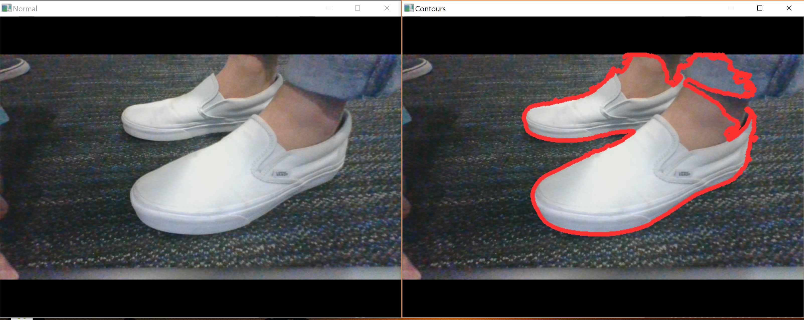

# SafeSkate

Computer Vision/IoT project for HackUCI 2020

Skate safer with SafeSkate!

## What it does

Real-time detection of obstructions for skareboards via computer vision

Alerts skater of objects on the road that may cause a fall

## Description

Are you a skater?

If yes, then chances are you have probably fallen from obstructions on the road.

What if something could warn you of objects getting in your path and save you from a potential fall?

That's where our project **SafeSkate** comes in.

Using a camera mounted to a skateboard, live footage is collected as you skate.

This footage is analyzed in real-time using computer vision via OpenCV on a Raspberry Pi.

If any object large enough to interfere your skating is detected, the backend script updates
a boolean value on Firebase to denote that an obstruction exists. 

Our frontend (we hope to integrate this into the remote for electric skateboards, but for now ran on your phone) continuously fetches from this database and warns the user with a sound if an obstruction is detected.

## Object Detection

Object detection is done with recognizing contours. Contours can be explained simply as a curve joining all the continuous points (along the boundary), having same color or intensity. 

Our backend script processes the video footage in real-time looking for contours to detect objects in the way.

The images below show what the camera is seeing and detecting. Normal(left) vs Contour Detection(right)

## Technologies Used

Backend:

* Python
* OpenCV
* numpy
* Firebase
* Raspberry Pi

Frontend:

* React.js
* HTML/CSS

## Install Dependencies
`pip install -r requirements.txt`